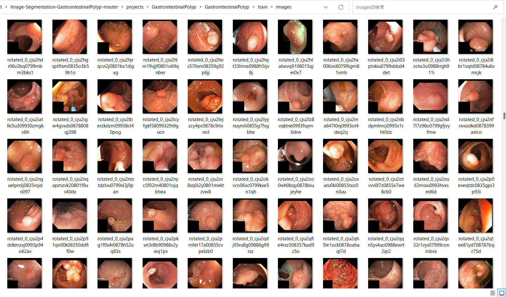
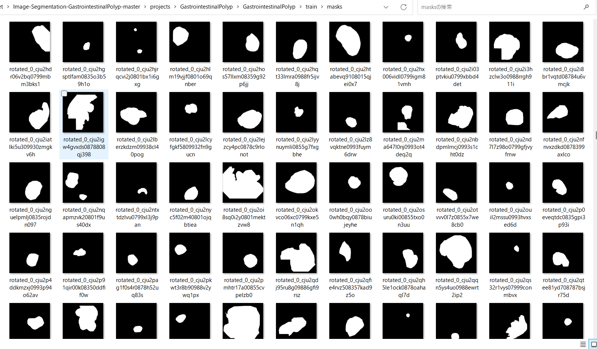
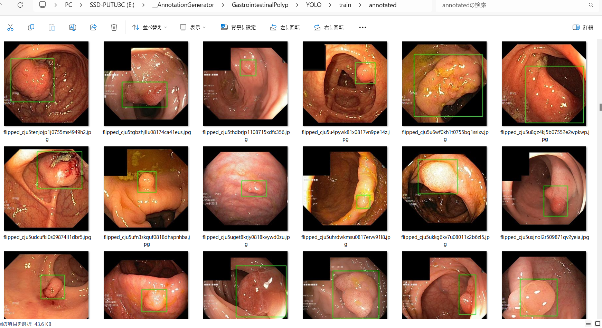

<h2>
GastrointestinalPolyp-Image-Dataset (2024/01/22)
</h2>
This is a GastrointestinalPolyp dataset for Image Segmentation and Object Detection.   
On ImageMaskDataet for Segmentation, 
please see also our first experiment 
<a href="https://github.com/atlan-antillia/Image-Segmentation-Gastrointestinal-Polyp">Image-Segmentation-Gastrointestinal-Polyp</a>
 

<h3>1. Dataset Citation</h3>

The image dataset used here has been taken from the following web site.

<pre>
Kvasir-SEG Data (Polyp segmentation & detection)
https://www.kaggle.com/datasets/debeshjha1/kvasirseg
</pre>

<h3>
2. Download master dataset
</h3>
 Please download the original dataset from the following link 
<pre>
Kvasir-SEG Data (Polyp segmentation & detection)
https://www.kaggle.com/datasets/debeshjha1/kvasirseg
</pre>
<b>Kvasir-SEG</b> dataset has the following folder structure. 
<pre>
Kvasir-SEG
├─annotated_images
├─bbox
├─images
└─masks
</pre>

<h3>
3. Create ImageMask dataset
</h3>
We have created the augmented <b>test</b>, <b>train</b> and <b>valid</b> datasets from the original <b>images</b> and <b>masks</b> datasets 
in Kvasir-SEG 
by using Python <a href="./generator/create_master_512x512.py">create_master_512x512.py</a> script. 
The script performs the following image processings. 
<pre>
1 Split the images and mask files into <b>train:0.7</b>,<b>valid:0.2 </b> and <b>test:0.1</b>.
2 Create 512x512 square images from original jpg files in <b>Kvasir-SEG/images</b> folder.
3 Create 512x512 square mask  rom original jpg files in <b>Kvasir-SEG/images</b> folder. 
4 Create flipped and mirrored images and masks of size of 512x512 to augment the resized square images and masks.
</pre>
The created <b>GastrointestinalPolyp</b> dataset has the following folder structure. 

<pre>
GastrointestinalPolyp
├─test
│  ├─images
│  └─masks
├─train
│  ├─images
│  └─masks
└─valid
    ├─images
    └─masks
</pre>
<b>Augmented image samples: GastrointestinalPolyp/train/images</b> 
 
<b>Augmented mask samples: GastrointestinalPolyp/train/mask</b> 
 

<h3>
4.Generate Annotation file
</h3>
<h3>
4.1 Generate YOLO Annotation
</h3>
To generate YOLO Anntotation files from the GastrointestinalPolyp datasets, 
please run Python script <a href="./YOLOAnnotationGenerator.py">YOLOAnnotationGenerator.py</a>. 
<pre>
python YOLOAnnotationGenerator.py
</pre>

This command generates the following YOLO folders, which contains <b>test</b>, <b>train</b> and <b>valid</b> 
<pre>
./YOLO
├─test
│  └─annotated
├─train
│  └─annotated
└─valid
    └─annotated
</pre>
For example, train folder contains a lot of jpg image files, yolo annotation text files, and annotated folder,
 
<pre>
train
├─annotated
├─flipped_cju0qkwl35piu0993l0dewei2.jpg
├─flipped_cju0qkwl35piu0993l0dewei2.txt
├─flipped_cju0qoxqj9q6s0835b43399p4.jpg
├─flipped_cju0qoxqj9q6s0835b43399p4.txt
...
</pre>
Annotated folder contains jpg image files with bounding boxes as shown below. 
 
 

<h3>
4.2 Generate TFRecord train and valid dataset
</h3>
By using <a href="https://github.com/sarah-antillia/AnnotationConverters/blob/main/YOLO2TFRecordConverter.py">YOLO2TFRecordConverter.py</a>  in <a href="https://github.com/sarah-antillia/AnnotationConverters">
AnnotationConverters</a>,
we have generated TFRecord dataset from train and valid dataset in YOLO annotation. 
<pre>
TFRecord
├─train
└─valid
</pre>

<h3>
4.3 Generate COCO test dataset
</h3>
By using <a href="https://github.com/sarah-antillia/AnnotationConverters/blob/main/YOLO2COCOConverter.py">YOLO2COCOConverter.py</a> in <a href="https://github.com/sarah-antillia/AnnotationConverters">
AnnotationConverters</a>,
we have generated COCO dataset from <b>test</b> dataset in YOLO annotation. 
<pre>
COCO
└─test
</pre>

<h3>
5. GastrointestinalPolyp Dataset for EfficientDet
</h3>
We have finally created the following <b>GastrointestinalPolyp-EfficientDet-Dataset</b> for 
<a href="https://github.com/google/automl/tree/master/efficientdet">efficientdet</a> object detection from TFRecord(train, valid) and COCO(test) dataset.
<pre>
GastrointestinalPolyp-EfficientDet-Dataset
├─test
├─train
└─valid
</pre>

You can download this dataset from the googole drive 
<a href="https://drive.google.com/file/d/1ilftnvULiFV8V1kjozJRNxvBpDe2pOE0/view?usp=sharing">
GastrointestinalPolyp-EfficientDet-Dataset.zip</a>

